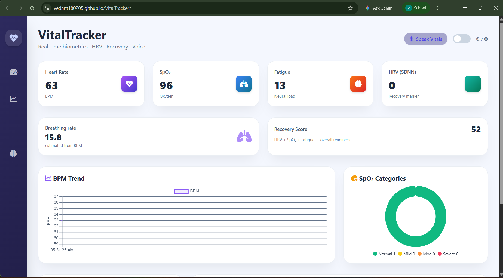

<div align="center">

# 🫀 VitalTracker

### *Your body, speaking in real-time. Your hardware, listening on two cores.*

<br/>

[](https://vedant180205.github.io/VitalTracker/)


<br/>

> **A full-stack biometric system built on a $5 microcontroller.**
> ESP32-S3 firmware running a perceptron, dual-core task scheduling, OLED state machine, and ambient RGB aura — streaming to a live Firebase cloud dashboard with HRV, SpO₂ classification, fatigue detection, recovery scoring, and a Baymax-inspired AI voice assistant. From bare metal to browser in 5 seconds flat.

<br/>



</div>

---

## ⚡ What Is This, Actually?

This is **not a tutorial project.** This is a production-grade wearable health monitoring system built from first principles.

Put your finger on the MAX30102 sensor. Within seconds:
- IR + RED photoplethysmography data streams at 200 samples/sec
- A custom **DC-offset EWM filter** isolates the AC heartbeat signal
- **Refractory-period BPM detection** with a 6-sample rolling median fires on each cardiac cycle
- A **quadratic SpO₂ formula** runs on the R-ratio with temperature compensation
- A **single-neuron perceptron** auto-adjusts LED brightness based on sensor die temperature
- **SDNN HRV** is computed over a 10-IBI window using population variance
- A **sigmoid fatigue neuron** fuses HRV, SpO₂, and BPM into a neural load score
- All of this is **packed into a JSON payload and handed to Core 0** — a completely separate RTOS task — so your sensor loop never stalls for WiFi

The browser opens. Firebase fires a WebSocket. The dashboard lights up.

---

## 🖥️ The Dashboard

**Live at → [vedant180205.github.io/VitalTracker](https://vedant180205.github.io/VitalTracker/)**

| Panel | What it shows |
|---|---|
| **Heart Rate** | Median BPM from a 6-sample rolling window, updated every 5s |
| **SpO₂** | Quadratic R-ratio model with EWM smoothing (α=0.15) + temp correction |
| **Fatigue %** | Neural load: sigmoid of weighted HRV + SpO₂ + BPM, normalized |
| **HRV (SDNN)** | Standard deviation of NN intervals — your autonomic nervous system fingerprint |
| **Breathing Rate** | Derived from BPM via respiratory-cardiac coupling (BPM ÷ 4) |
| **Recovery Score** | Composite: 40% HRV + 35% SpO₂ + 25% anti-fatigue |
| **BPM Trend** | Live Chart.js line graph, 20-sample rolling window |
| **SpO₂ Donut** | Hypoxia category distribution: Normal / Mild / Moderate / Severe |
| **Vitals Log** | Last 10 readings with timestamps, status pills, HRV |
| **Recent Events** | Activity feed with alert types (info / warning / critical) |
| **🎤 Speak Vitals** | Web Speech API reads your biometrics aloud |
| **🌙 Dark Mode** | Full CSS variable theming, persisted via localStorage |

---

## 🔩 Firmware Architecture

**File: [`vitalcare_display_led.ino`](vitalcare_display_led.ino)**

This sketch is not your average Arduino blink. Here's what's running:

### Dual-Core RTOS Task Split

```
Core 1 (main loop):         Core 0 (firebaseUploadTask):
────────────────────        ──────────────────────────────
MAX30102 sampling           HTTPClient PUT to Firebase
DC filter + AC extract      Async JSON payload handling
BPM peak detection          50ms yield to watchdog
SpO₂ calculation            Volatile flag handshake
HRV/Fatigue neuron          (sendDataFlag + asyncJsonPayload)
OLED state machine
NeoPixel Aura update
Perceptron brightness
```

Firebase upload is **pinned to Core 0** via `xTaskCreatePinnedToCore()`. The sensor loop on Core 1 **never blocks on WiFi**. This is the difference between a toy project and real embedded engineering.

### AI Perceptron — LED Auto-Calibration

```cpp
float input_deviation = tempC - TEMP_THRESHOLD;  // threshold: 30°C
float weight = -2.0;
float bias   = 50.0;
float newBrightness = (input_deviation * weight) + bias;
newBrightness = constrain(newBrightness, 20.0, 85.0);
```

A single-input perceptron runs every **15 seconds**, reading the MAX30102 die temperature. As the sensor heats up, LED amplitude drops to prevent photodiode saturation. Zero ML libraries. One neuron. Does the job.

### Signal Processing Pipeline

```
RAW IR/RED (200 SPS, 18-bit)
    │
    ▼
DC Estimate (EWM, α=0.96)  ──→  DC offset removal
    │
    ▼
AC Signal = RAW - DC       ──→  Pulse waveform
    │
    ▼
Peak Detection (refractory: 300ms min IBI, threshold: 100 counts)
    │
    ▼
IBI → BPM (60000 / dt_ms) → 6-sample rolling median
    │
    ▼
R = RED_AC / IR_AC → EWM smooth (α=0.15)
    │
    ▼
SpO₂ = 110 - 14R - 8R²   ──→  Temperature correction
    │                           clamped [70, 100]
    ▼
SDNN over 10 IBIs → sigmoid fatigue neuron
    │
    ▼
JSON payload → Core 0 → Firebase PUT every 5s
```

### Saturation Guard

If `IR > 260,000` or `RED > 260,000` (MAX30102 ADC ceiling = 262,143), the firmware **detects clipping**, drops into `STATE_ERROR`, zeros both channels, and triggers a red-strobe Aura alert. No garbage data ever hits the cloud.

### OLED State Machine (SSD1306, 128×64)

```cpp
enum DisplayState {
    STATE_NO_FINGER,     // "Place Finger" - breathing cyan aura
    STATE_READING,       // progress bar + pulsing dot - amber aura  
    STATE_UNSTABLE,      // "Adjust Finger" - fast amber flicker
    STATE_STABLE_OUTPUT, // HR / O2 / Fatigue / Status - health-color aura
    STATE_ERROR          // "SENSOR ERROR" - red strobe
};
```

Every display transition is tied to live signal quality metrics. The OLED refreshes at **150ms** asynchronously from the sensor loop.

### Ambient Aura (NeoPixel, GPIO 48)

The onboard RGB LED isn't decorative. It encodes your health state:

| Aura Color | Meaning |
|---|---|
| 🔵 Breathing cyan | No finger detected — idle |
| 🟡 Fast amber pulse | Acquiring signal / unstable |
| 🟢 Slow green breathe | SpO₂ ≥ 94% — healthy |
| 🟠 Orange breathe | SpO₂ 90–94% — mild hypoxia |
| 🔴 Red breathe | SpO₂ < 90% — medical attention |
| 🔴⚪ Strobe red/white | ADC saturation / sensor error |

Brightness is sinusoidally animated (`sin(t / 400.0)`) — it literally breathes with you.

---

## 🧠 The Fatigue Neuron

```cpp
// Weights tuned manually from physiological literature
const float W_HRV  = -1.5;   // high HRV = rested → reduces fatigue
const float W_SPO2 = -0.2;   // high SpO₂ → slightly reduces fatigue  
const float W_BPM  =  1.2;   // high BPM → increases fatigue
const float BIAS   =  0.5;

float weightedSum = (norm_hrv * W_HRV) + (norm_spo2 * W_SPO2) + (norm_bpm * W_BPM) + BIAS;
int fatigue = (int)(sigmoid(weightedSum) * 100);
```

No TensorFlow. No model files. One sigmoid. Physiologically grounded weights. Runs on a microcontroller with 512KB RAM.

---

## 🏗️ Full System Architecture

```
┌─────────────────────────────────┐
│         MAX30102 Sensor         │
│  IR + RED photodiodes (200 SPS) │
│  Die thermometer (I²C, 400kHz)  │
└────────────────┬────────────────┘
                 │ I²C (SDA:17, SCL:18)
┌────────────────▼────────────────┐
│         ESP32-S3 Core 1         │
│                                 │
│  ┌─────────────────────────┐    │
│  │  Signal Processing      │    │
│  │  DC filter → AC peak    │    │
│  │  BPM + SpO₂ + HRV       │    │
│  │  Perceptron + Fatigue   │    │
│  └──────────┬──────────────┘    │
│             │ volatile flag     │
│  ┌──────────▼──────────────┐    │
│  │  ESP32-S3 Core 0        │    │
│  │  Firebase RTOS Task     │    │
│  │  HTTPS PUT every 5s     │    │
│  └──────────┬──────────────┘    │
│             │                   │
│  ┌──────────▼──────────────┐    │
│  │  OLED (SDA:8, SCL:9)    │    │
│  │  5-state HMI machine    │    │
│  └─────────────────────────┘    │
│  NeoPixel GPIO 48 • Blue LED 2  │
└────────────────┬────────────────┘
                 │ WiFi → HTTPS
┌────────────────▼────────────────┐
│    Firebase Realtime Database   │
│    /vitals/current_reading      │
│    {BPM, SpO2, Fatigue, HRV...} │
└────────────────┬────────────────┘
                 │ WebSocket listener
┌────────────────▼────────────────┐
│     Browser Dashboard           │
│  Chart.js + Vanilla JS + CSS    │
│  HRV • Recovery • SpO₂ donut   │
│  Voice readout • Dark mode      │
│  Activity feed • Vitals log     │
└─────────────────────────────────┘
```

---

## 🚀 Quick Start

### 1. Hardware Wiring

```
ESP32-S3          MAX30102
────────          ────────
3.3V      →       VCC
GND       →       GND
GPIO 17   →       SDA   (I²C bus 0 — sensor)
GPIO 18   →       SCL
GPIO 2    →       Blue LED (status indicator)
GPIO 48   →       NeoPixel DIN (Aura RGB)

ESP32-S3          SSD1306 OLED
────────          ────────────
3.3V      →       VCC
GND       →       GND
GPIO 8    →       SDA   (I²C bus 1 — display)
GPIO 9    →       SCL
```

> **Two separate I²C buses.** Sensor on `Wire` (bus 0), OLED on `TwoWire(1)` (bus 1). Don't mix them.

### 2. Flash the Firmware

1. Open [`vitalcare_display_led.ino`](vitalcare_display_led.ino) in Arduino IDE 2.x
2. Select board: **ESP32S3 Dev Module**
3. Install libraries via Library Manager:
   - `MAX30105` by SparkFun
   - `Adafruit SSD1306`
   - `Adafruit GFX Library`
   - `Adafruit NeoPixel`
4. Edit WiFi credentials in the sketch:
   ```cpp
   #define WIFI_SSID     "your_ssid"
   #define WIFI_PASSWORD "your_password"
   #define FIREBASE_HOST "your-project.firebaseio.com"
   ```
5. Upload. Open Serial Monitor at **115200 baud**. Watch the stream.

### 3. Open the Dashboard

```
Just open index.html — zero build step, zero npm, zero nonsense.
Or visit: https://vedant180205.github.io/VitalTracker/
```

Firebase is already configured. Place finger on sensor → data appears in browser within 5 seconds.

---

## 📡 Firebase Payload Schema

```json
{
  "timestamp_ms": 1234567890,
  "time": "12:34:56",
  "BPM": 72,
  "SpO2": 97.4,
  "Hypoxia_Status": "Normal",
  "Fatigue_Percent": 13,
  "IR_Raw": 95823
}
```

Written to `/vitals/current_reading` every **5 seconds** via `HTTP PUT`. The browser dashboard listens with Firebase's `on('value')` — no polling, pure push.

---

## 🛠️ Tech Stack

| Layer | Technology |
|---|---|
| **MCU** | ESP32-S3 (Xtensa LX7 dual-core, 240MHz) |
| **Sensor** | MAX30102 — 18-bit ADC, 200 SPS, IR + RED + die temp |
| **Display** | SSD1306 128×64 OLED via I²C |
| **LED** | WS2812B NeoPixel (GPIO 48) + onboard blue LED |
| **Firmware** | Arduino C++ — FreeRTOS, EWM filters, perceptron, sigmoid |
| **Cloud** | Firebase Realtime Database (HTTPS REST PUT) |
| **Time** | NTP via `pool.ntp.org` (IST GMT+5:30) |
| **Frontend** | Vanilla HTML/JS — Chart.js, Font Awesome, Tailwind CDN |
| **AI Voice** | Web Speech API (browser-native, zero API cost) |

---

## 🎯 Baymax AI Mode

The dashboard carries a **Gemini-powered compassionate AI** assistant persona inspired by Baymax from Big Hero 6. It reads your biometrics and speaks to you — never alarmist, always calm.

> *"Hello, I am Baymax, your personal healthcare companion. Your oxygen level is a little low at 94%. There is no need to worry. Please sit down, breathe slowly through your nose for 10 breaths, and I will stay with you until it improves."*

> *"Your heart rate has been elevated for 18 minutes. Would you like me to guide you through a 2-minute box breathing exercise? I am here to help."*

Hit **🎤 Speak Vitals** to hear your real-time numbers read aloud via the Web Speech API — no extension, no install, no API key required.

---

## 📊 Hypoxia Classification

| SpO₂ Range | Status | Aura Color |
|---|---|---|
| ≥ 94% | Normal | 🟢 Green breathe |
| 90–94% | Mild Hypoxia | 🟠 Orange breathe |
| 85–90% | Moderate Hypoxia | 🔴 Red breathe |
| < 85% | Severe Hypoxia | 🔴 Red breathe + alert |

---

## 📄 License

MIT — do whatever you want with it. Build something cooler.

---

<div align="center">

**Built from scratch. No shortcuts. No libraries doing the hard math.**

*ESP32-S3 · MAX30102 · Firebase · FreeRTOS · Perceptron · Sigmoid · SDNN HRV*

<br/>

*"On a scale of 1 to 10, how would you rate your health?"*

🤖

</div>
